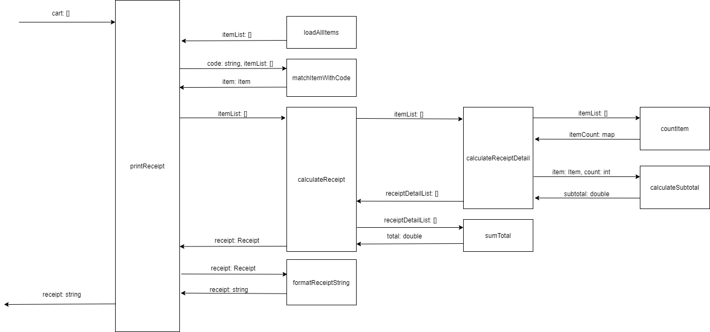

# POS Project v0.2

POS Cash Register Version：v0.2

## Teaching Objectives

1. Learn to convert basic descriptions into procedures;
2. Ability to navigate three cycles；

## Description of Requirement

The store will use the cash register (POS) systems when shopping settlement, This cashier will settle and print the receipt (Receipt) according to the item in the customer's shopping cart (Cart) at the time of settlement.

We need to implement a function called `printReceipt`, This function can input data of the specified format as a parameter and then output the text of the receipt in the browser console.

Input format（example）：

```javascript

[
  'ITEM000000',
  'ITEM000000',
  'ITEM000000',
  'ITEM000000',
  'ITEM000000',
  'ITEM000001',
  'ITEM000001',
  'ITEM000004'
]

```

List Contents（example）：

```
***<store earning no money>Receipt ***
Name: Coca-Cola, Quantity: 5 bottles, Unit price: 3.00 (yuan), Subtotal: 15.00 (yuan)
Name: Sprite, Quantity: 2 bottles, Unit price: 3.00 (yuan), Subtotal: 6.00 (yuan)
Name: Battery, Quantity: 1, Unit price: 2.00 (yuan), Subtotal: 2.00 (yuan)
----------------------
Total: 23.00 (yuan)
**********************
```

## Homework requirements

1. According to the test case in ```test/main-test.js```，Write the implementation code in the ```main/main.js``` file and make sure the test passes;
2. Please complete the assignment with the least number of lines of code as much as possible while ensuring the readability of the code;
3. Run the `run.html` file below the file to make the test pass;

## Homework Reminder

1. Learn to traverse to find content


2. Use the `loadAllItems()` method to get all the items, This method returns the result as an array containing the item objects.（example）：

   ```
   [ item1, item2, item3, ..., itemN ]
   ```

3. The structure of each commodity object is as follows（example）：

   ```javascript
   {
      barcode: 'ITEM000000',
      name: 'Coca-Cola',
      unit: 'bottles',
      price: 3.00
   }
   ```

4. You should learn and be good at using the Console feature in the developer tools that come with the popular browsers.

## Context Map

